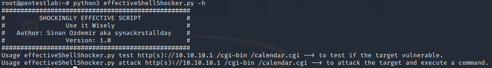
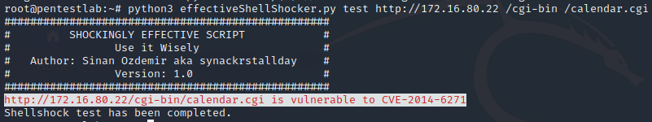
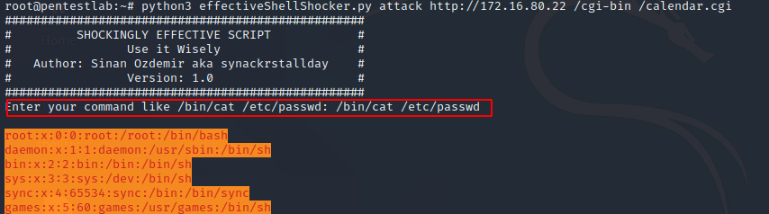
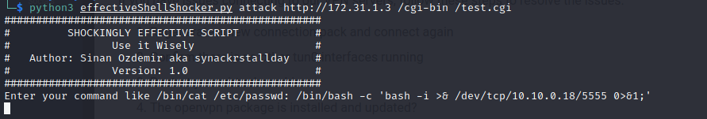

# effectiveShellShocker
This is a Python script that tests for http shellshocker vulnerability. If it exists, it allows you to run commands remotely.

Simple Usage:
```bash
python3 effectiveShellShocker.py -h
```


```bash
python3 effectiveShellShocker.py test http://172.16.80.22 /cgi-bin /calendar.cgi
```


```bash
python3 effectiveShellShocker.py attack http://172.16.80.22 /cgi-bin /calendar.cgi
```


Reverse shell:


Thank you
